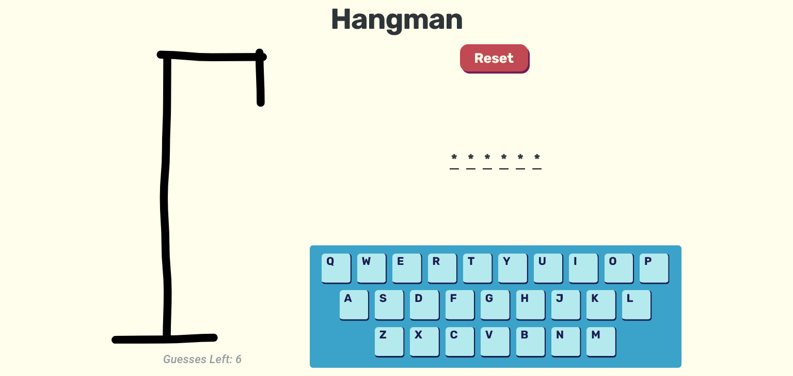
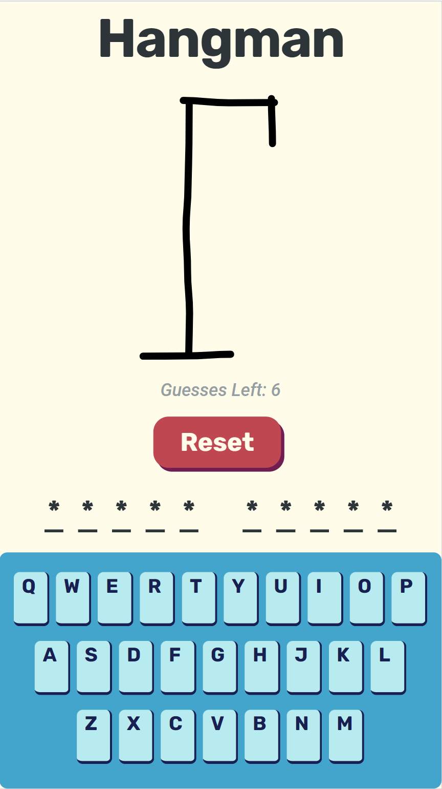
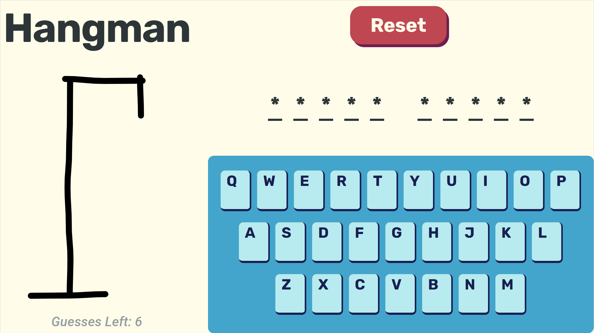

# hangman

## `arealglitterboy`

---

A simple hangman puzzle game to play inside the browser. Uses a custom on screen keyboard to allow input by both external and on screen keyboard.

---

### Screenshots

#### Desktop

#### Mobile

#### Remaining Goals

- [x] Add on screen keyboard
- [x] Improve the css
- [x] Clean up render pipeline
